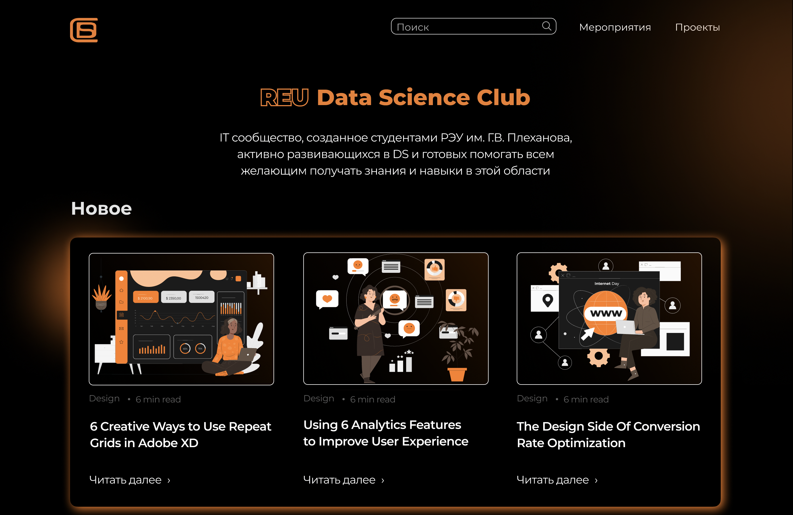

# DS-CLUB Website
## https://datasaynsklab.webflow.io/

Сайт IT-сообщества, созданного студентами РЭУ им. Г.В. Плеханова, активно развивающихся в DS и готовых помогать всем желающим получать знания и навыки в этой области

В данном репрозитории вы можете увидеть 2 версии нашего сайта. Первая это осзданная с помощью javascript библиотеки React. Вторая созданная с помощью low-code платформы Webflow. Версии имеют отличия.

Подробнее о процессе создания - https://reu-ds-club.notion.site/REU-Data-Science-Club-a1978e019da6433b8af9b14c8609de50

#### Как установить версию React
1. Если вы ни разу не работали с React, вам нужно установить Node.js на ваш компьютер(https://nodejs.org/en/download/)
2. Вы создаете папку в удобном вам месте и открываете ее в удобном для вас IDE(в нашем случае VScode)
3. Для старта нужно прописать в терминале с указанным к папке путем команду - "npx create-react-app ./". После этого вы увидите несколько новых папок
4. Затем нужно установить несколько библиотек с помощью нескольких комманд: 
- npm install react-router-dom
- npm install react-native --force
- npm install @ericz1803/react-google-calendar --force
5. Теперь вы должны скачать папку React с этого репрозитория, переименовать её в src и заменить ей папку src в вашем react приложении
6. Прописываете команду "npm start" и локальный сервер с сайтом запускается

#### Как установить версию Webflow
1. Вам нужно скачать соответствующую папку с нашего репрозитория
2. Найти файл с названием index.html, нажать по нему и выбрать опцию открыть с помощью любого браузера
